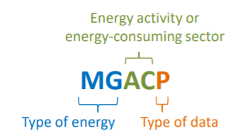
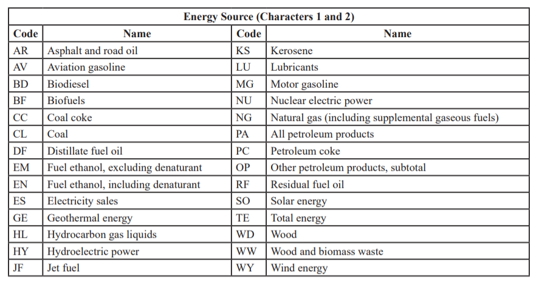
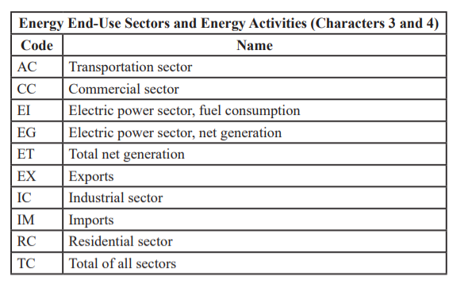
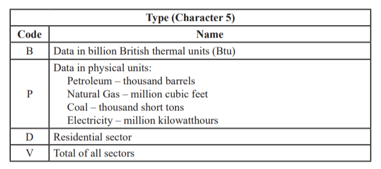
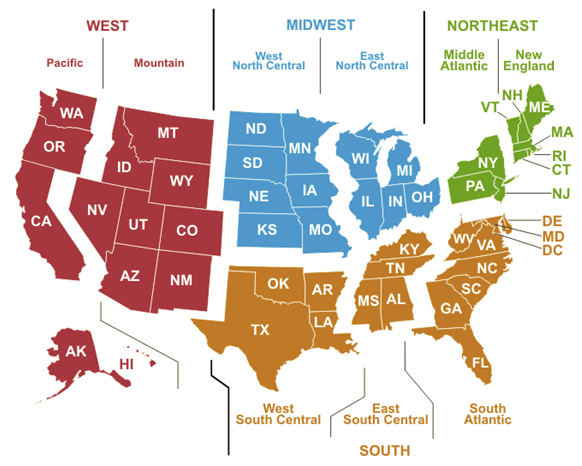
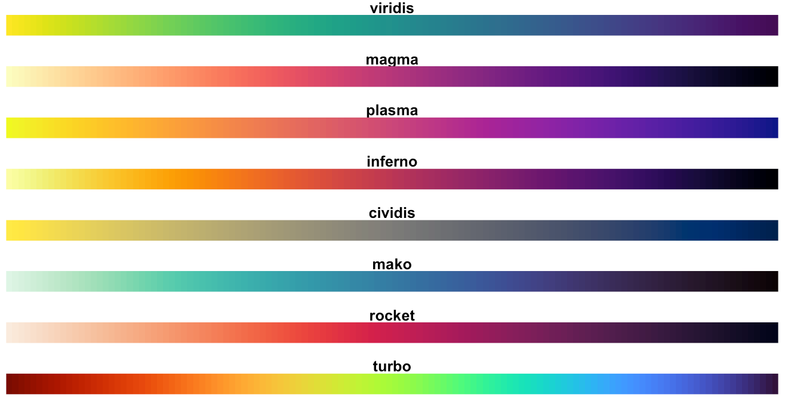
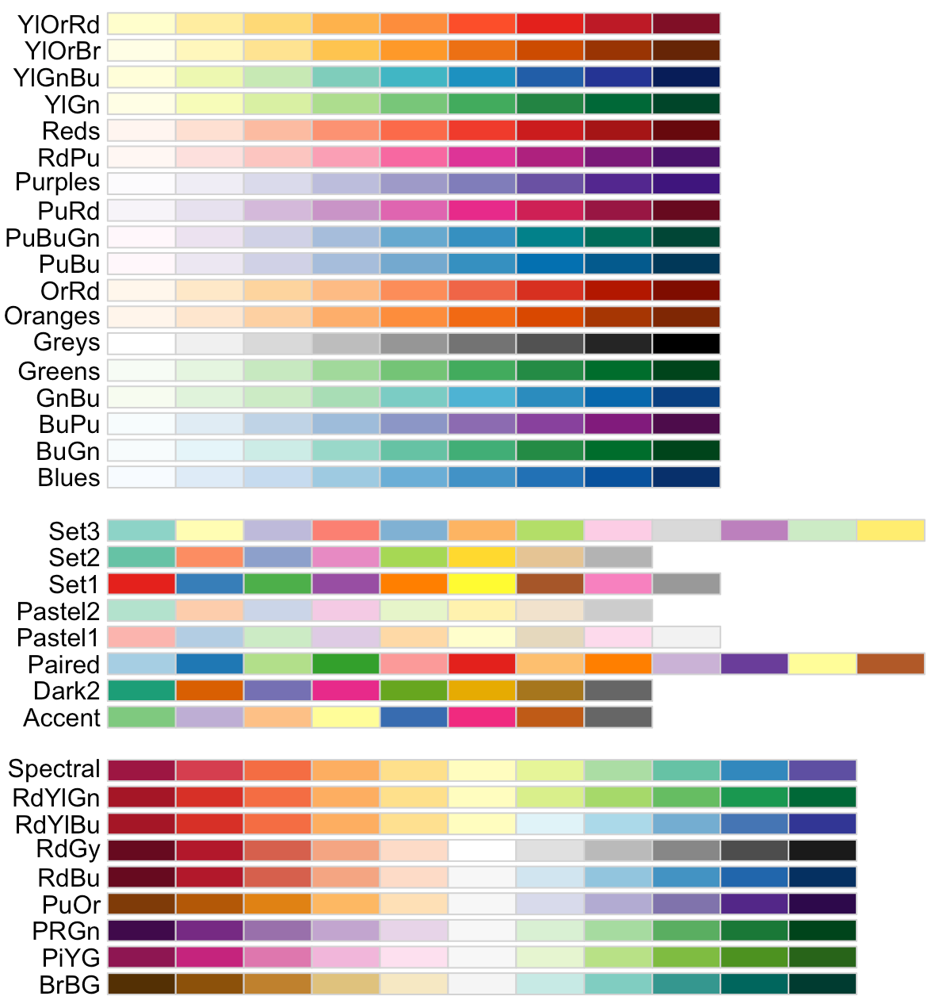

```{r setup, include=FALSE}
knitr::opts_chunk$set(echo = TRUE, warning=FALSE)
```

## SEDS background (review)

The State Energy Data System (SEDS) dataset consists of more than 700 energy-related variables for the U.S., 50 states, and Washington D.C. covering the years 1960 to about two years before the current year. To manipulate this large dataset we will be using the R tidyverse package of packages, and the dplyr and ggplot packages that are part of the tidyverse.

## Basic tidyverse/dplyr (review)

Here are the main tidyverse/dplyr commands we've already used:

1. **select** creates a subset of the columns in a dataframe.  There are many ways to designate the selected columns.  Two of the most frequent are listing the columns separated by commas: **select(msn, data)** and designating a variable to NOT select with the minus sign: **select(-data_series).**
2. **filter** creates a subset of the rows in a dataframe.  You specify a logical condition that filter applies to each row.  If the condition is true the row is included.
3. **mutate** creates a new variable as a result of a mathematical operation or some other manipulation of the existing data in each row.  For **mutate** to do it's job well it needs the input data for the calculation to be available somewhere within the row, except for constant values.
4. **read_csv** reads a comma-delimited csv file into a dataframe.  In most cases, the first row of the csv file contains a set of variable names.
5. **read_excel** reads an Excel spreadsheet into a dataframe.  Options include specifying the sheet/page name (sheet="Sheet3") and skipping a specific number of lines before reading a row of variable names (skip=10)
6. **ifelse** is a function often used within mutate. For each dataframe row it evaluates a condition and returns one value if the condition is true and another value if the condition is false.  Example: mutate(statetype = ifelse(stateabbr %in% c("GA", "SC", "NC", "TN", "AL", "FL", "southeast", "other")

One final reminder, the basic format of tidyverse/dplyr commands is

```
outdf = indf %>% 
        command1() %>% 
        command2() %>% 
        command3()
```

-----

Here are the major commands we'll be using in the lab

1. **join_left** merges data into the primary dataframe from a second dataframe based upon a common variable or variables shared by both dataframes.

2. **group_by** breaks the dataframe into subgroups and processes subsequent commands separately for each subgroup as if it were a separate dataframe.

3. **summarize** often directly follows group_by.  It reduces each subgroup in a dataframe to a single record and calculates the count or sum or mean or weighted mean (or any other function) of each subgroup of records.  After summarize, there is only one record for each subgroup in the dataframe.

4. **pivot_wider** transforms a longer dataframe into a wider dataframe. Values of a categorical variable in the input dataframe become the names of the new variables, and values of a second variable become the content of the new variables.

5. **pivot_longer** transforms a set of columns from a wider dataframe into a longer dataframe.  The names of the columns become the values of a new categorical variable, and the values in the columns become the data-values of the new categorical variable.

6. **bind_cols** merges data into the primary dataframe from a second dataframe by combining the first record of the primary dataframe with the first record of the second dataframe, etc.

7. **bind_rows** merges the rows of the primary dataframe with the rows of a second dataframe (and additional dataframes, if needed).  Shared variables are merged into the same column(s).


## Setup Lab


Open seds-lab-1.html in a Web browser.

From the class1121 folder, right-click on seds-lab-1.R and open in RStudio.

The first block of code for loading libraries is already entered.  Highlight those commands and press CTRL+ENTER to execute.

This code loads libraries and a set of Drummond's custom functions.  If you get an error, you may need to install one or more libraries.

```{r Setup, results="hide",warning=FALSE,message=FALSE}
library(tidyverse)
library(readxl)
library(sf)
library(tmap)
library(RColorBrewer)
library(viridis)

# setwd("c:/temp/class1122")

source("functions.R")
```

## Load Complete SEDS and other datasets

The data source is from:

https://www.eia.gov/state/seds/seds-data-complete.php?sid=US#CompleteDataFile

We'll read the complete SEDS with read_csv.  Drummond's custom tolow3() function (see code in functions1b.R in the functions folder) converts variable names to valid R lowercase names with underscores replacing any periods or spaces.

The msn1 dataframe reads from a spreadsheet the entire list of variables in the complete SEDS.

The stateinfo1 dataframe is a set of different designations for the states, including FIPS codes, postal abbreviations, Census regions, and Census divisions.


```{r}
# Block 1

seds1 = read_csv("Complete_SEDS.csv") %>% 
  tolow3()

msn1 = read_excel("Codes_and_Descriptions.xlsx", sheet="MSN Descriptions", skip=9) %>% 
  tolow3()

stateinfo1 = read_excel("stateinfo6.xls")

```

The columns in the SEDS dataframe are:

* data_status: information on the dataset version/release
* msn: a five letter code for the specific series/variable
* statecode: two letter postal abbrivation for each state
* year: year for which data was collected
* data: actual data value
  
This is a "long" dataframe.  There are so many variables in SEDS it would be exceedingly awkward to place each one in a column.  Instead the msn value tells us what is being measured, and data value is the actual amount.

View the msn1 dataframe. Spend 5 minutes browsing the msn descriptions.

The five-character msn consists of three parts:

* Characters 1-2 are the source fuel
* Characters 3-4 are the end-use sector using the energy
* Character 5 is the units of the data value
  
Here are the common codes used in the msns:


{ width=75% }


{ width=100% }

{ width=75% }

{ width=75% }
-----

The st1 command loads a GIS shapefile of states.

```{r}
# Block 2
st1 = st_read("cb_2018_us_state_20m.shp") %>% 
  tolow3() %>% 
  mutate(statecode = stusps) %>% 
  filter(statecode != "AK" & 
           statecode != "HI" &
           statefp <= "56") %>% 
  mutate(stateabbr = statecode) %>% 
  left_join(stateinfo1)

```

The mutate command creates a new variable to contain the two-character state postal codes from statecode.  The new stateabbr variable will then be used by left_join.  The join commands search for matching variable names in the two dataframes, then match records whenever it finds equal variable values in all common variables.

Any records in the second dataframe that don't match records in the primary dataframe are ignored.  Unmatched records in the primary dataframe are retained with NA values assigned to variables added from the second dataframe.

The left_join is very common in GIS work since it enables us to add attribute data to a spatial dataset, then map and analyze the result.

There are other variations of left_join:

* right_join: the second dataframe rather than primary dataframe becomes the basis for the join.  The output dataframe will have the same number of records as the second dataframe.

* inner_join retains only matched records with data contributed from both dataframes

* full_join retains all unmatched records from both dataframes

-----

Variables added in the left_join include the Census four region's FIPS codes and names, and the Census nine division's FIPS codes and names.  The following two tmaps color the states so you can see the region and division areas.  Georgia is in the South region and the South Atlantic division.


```{r}
# Block 3
tmap_mode("view")

tm_shape(st1) +
  tm_polygons(col="regname")
```


```{r}
# Block 4
tm_shape(st1) +
  tm_polygons(col="divname")

```

For easy reference, here is a Census map of the regions and divisions.

{ width=75% }


## Analysis of electricity major fuel trends by Census state groups

Rather than work with all 50 states, we may be better able to analyse electricty fuel trends by grouping states.

We first left_join the seds data to stateinfo1.  Because the two dataframes have no variable names in common, we designate the two different variables, both of which contain two-character state postal abbreviations.

We also filter for the three major electricity fuels and population, and remove the data for the entire US

```{r}
# Block 5
seds2 = seds1 %>% 
  left_join(stateinfo1, 
            by=c("statecode" = "stateabbr")) %>% 
  filter(msn %in% c("CLEIB", "NGEIB", "NUEGB", "TPOPP")) %>% 
  filter(statename != "United States")

```

We can now group_by and summarize for the nine Census divisions:

```{r}
# Block 6

sedsdiv3 = seds2 %>% 
  group_by(divname, year, msn) %>% 
  summarize(divdata = sum(data))
```

We'll also be interested in per capita fuel use.  Currently msn is one variable (column) and the data itself is a second.  To calculate per capita fuel use, we'll need to have each msn in its own column.

The pivot_wider command allows us to generate separate columns for each msn.  Column names will come from the current msn values (CLEIB, NGEIB, NUEGB and TPOPP), and the datavalues in those four columns will come from the existing column named "data."

```{r}
# Block 7
sedsdiv4 = sedsdiv3 %>% 
  pivot_wider(names_from=msn,values_from=divdata) %>% 
  tolow() %>% 
  mutate(coalpercap = cleib/tpopp,
         ngaspercap = ngeib/tpopp,
         nuclpercap = nuegb/tpopp)
```

We can now plot longterm trends in the three fuels by the nine Census divisions.  This allows us to make overall geographic comparisions, which would be more difficult if we used all 50 states.

ggplot, part of the tidyvers, is the premier graphics program for R.  Sadly, it is not compliant with dplyr syntax since it was developed before dplyr.  It has a "grammar of graphics" that links together commands with "+" rather than "%>%". Chapter 3 of R for Data Science has an excellent discussion with great examples 

Here are some basic elements of ggplot:

1. Start with a ggplot command. Dataframe data for the entire chart can be specified in the ggplot command.
2. Next comes a drawing command, such as "geom_line()."
* Within the drawing command is an aesthetics subcommand
+ The aes() subcommand relates dataframe columns in the dataset to particular features of the elements being draw.
+ Inside the aes(), for a scatterplot we specify columns for the x and y dimensions
+ Inside the aes(), we can specify a column to use for drawing different colors
* Outside of the aes() but inside the drawing command we can specify line (or other drawing element) characteristics that apply to ALL lines and are not linked to a specific field, such as the lwd=1.25 subcommand.
3. We can now add other ggplot commands that apply to the entire chart, such as a color palette, axis and chart titles, etc.


```{r}
# Blocks 8, 9 and 10
ggplot(data=sedsdiv4) +
  geom_line(aes(x=year,y=coalpercap, col=divname),lwd=1.25) +
  scale_color_brewer(palette = "Set3") +
  ggtitle("Coal per capita energy use")

ggplot(data=sedsdiv4) +
  geom_line(aes(x=year,y=ngaspercap, col=divname),lwd=1.25) +
  scale_color_brewer(palette = "Set3") +
  ggtitle("Natural gas per capita energy use")

ggplot(data=sedsdiv4) +
  geom_line(aes(x=year,y=nuclpercap, col=divname),lwd=1.25) +
  scale_color_brewer(palette = "Set3") +
  ggtitle("Nuclear per capita electricity generated")
```
## Analysis of electricity renewable trends by Census state groups

The following commands process the three major renewables (solar, wind, and hydro) in the same way we processed the three traditional fuels.

```{r}
# Blocks 11, 12, and 13
seds12 = seds1 %>% 
  left_join(stateinfo1, by=c("statecode" = "stateabbr")) %>% 
  filter(msn %in% c("HYEGB", "WYEGB", "SOEGB", "TPOPP")) %>% 
  filter(statename != "United States")

sedsdiv13 = seds12 %>% 
  group_by(divname, year, msn) %>% 
  summarize(divdata = sum(data))

sedsdiv14 = sedsdiv13 %>% 
  pivot_wider(names_from=msn,values_from=divdata) %>% 
  tolow() %>% 
  mutate(hydrpercap = hyegb/tpopp,
         solapercap = soegb/tpopp,
         windpercap = wyegb/tpopp)
```

### Sidenote: Example of pivot_longer command

Below is a quick example of the pivot_longer command that converts a wider dataframe into a longer dataframe.

Note that there are three inputs required for pivot_longer:

* the column names to convert, 
* the new column name to store the former column names, and 
* the new column name to store the datavalues.

but only two required for pivot_wider:

* the current column name storing the categorical variable values that will become new column names, and
* the current column name storing the datavalues that will be stored in the new columns

```{r}
# Block 14
sedsdiv14long = sedsdiv14 %>% 
  pivot_longer(hyegb:windpercap,
               names_to="varname",
               values_to="data")
```

-----

The following ggplot charts show renewable electricity generation trends over time

```{r} 
# Blocks 15, 16, and 17
ggplot(data=sedsdiv14) +
  geom_line(aes(x=year,y=solapercap, col=divname),lwd=1.25) +
  scale_color_brewer(palette = "Set3") +
  ggtitle("Solar per capita electricity generated") 

ggplot(data=sedsdiv14) +
  geom_line(aes(x=year,y=windpercap, col=divname),lwd=1.25) +
  scale_color_brewer(palette = "Set3") +
  ggtitle("Wind per capita electricity generated")

ggplot(data=sedsdiv14) +
  geom_line(aes(x=year,y=hydrpercap, col=divname),lwd=1.25) +
  scale_color_brewer(palette = "Set3") +
  ggtitle("Hydroelectric per capita electricity generated") 
```

## Mapping electricity imports and exports

Our final task for today will be to explore state-to-state electricity flows.  In calculating state electricity CO2 emissions it can be important to include emissions from inflows of out-of-state electricity, and deduct emissions from outflows that are consumed in other states.

The following code pulls net interstate flows from SEDS, filters for the year 2019 only, and calculates per capita flows.

The SEDS data is joined to our GIS dataframe, then viewed in tmap.


```{r}
# Blocks 18, 19, and 20

imports = seds1 %>% 
  filter(year == 2020 & msn %in% c("ELISP","TPOPP")) %>% 
  pivot_wider(names_from=msn, values_from=data) %>% 
  mutate(importspercap = ELISP/TPOPP)

st2 = st1 %>% 
  left_join(imports) %>% 
  select(stateabbr,ELISP)

tmap_mode("view")

tm_shape(st2) +
  tm_polygons("ELISP",palette="BrBG",n=8) +
  tm_layout("Electricity Imports in Millions of kWh") +
  tm_view(view.legend.position = c("right","bottom"))
```

What state is the biggest importer?

What state is the biggest exporter?

What state is the second biggest exporter?

What importing states are adjacent to the second biggest exporter? 


## Reference charts of Viridis and RColorBrewer palettes

{ width=75% }

----------------------

For reference, here are the more sedate palettes from RColorBrewer:

{ width=75% }


